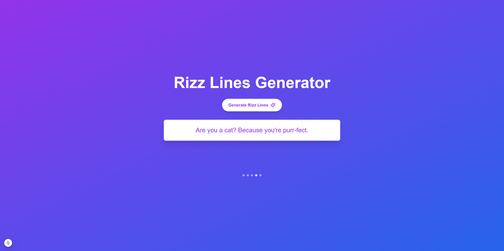

# Rizz Lines Generator

This is a [Next.js](https://nextjs.org) project that generates smooth pickup lines and flirty messages.



## Getting Started

First, run the development server:

```bash
npm run dev
# or
yarn dev
# or
pnpm dev
# or
bun dev
```

Open [http://localhost:3000](http://localhost:3000) with your browser to see the result.

You can start editing the page by modifying `app/page.tsx`. The page auto-updates as you edit the file.

## Features

- Generate unique rizz lines and pickup lines with one click
- Multiple rizz line styles (casual, romantic, funny, and smooth)
- AI-powered rizz generator for personalized results
- Save your favorite rizz lines to your collection
- Share your best rizz lines on social media
- Mobile-friendly rizz lines generator
- Copy rizz lines directly to clipboard
- New rizz lines updated daily

## FAQ

### What is a Rizz Lines Generator?
A Rizz Lines Generator is an AI-powered tool that creates smooth pickup lines and flirty messages. Our rizz generator helps you create unique and engaging conversation starters.

### How does the Rizz Lines Generator work?
The Rizz Lines Generator uses advanced AI to create unique pickup lines based on different styles and contexts. Simply click the generate button to get new rizz lines instantly.

### Are these rizz lines original?
Yes, our Rizz Lines Generator creates unique and original pickup lines every time. Each generated rizz line is crafted to be fresh and engaging.

### Can I use the Rizz Lines Generator for free?
Yes, the basic Rizz Lines Generator features are completely free to use. Premium features are available for advanced rizz generation capabilities.

### How often are new rizz lines added?
Our Rizz Lines Generator database is updated daily with new templates and patterns to ensure fresh and current pickup lines.